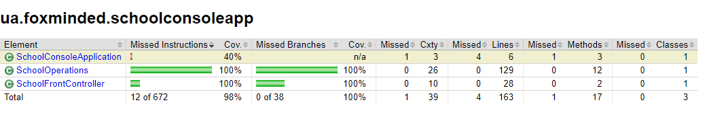
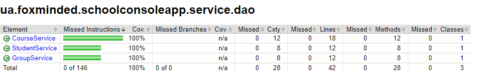
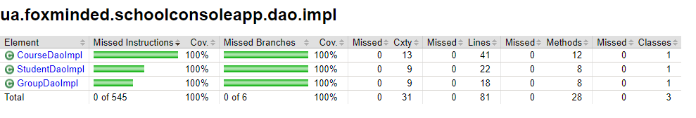

# task2.3

The 'school-console-app' is a Spring Boot application for managing school data, now bolstered by a
new service layer. This layer ensures a cleaner and more maintainable interaction between our DAOs
and business logic, enhancing the overall code structure. Alongside this architectural improvement,
the application efficiently handles database interactions for various school operations, such as
managing groups, students, and courses, using the Spring JDBC API with PostgreSQL as the underlying
database system.

