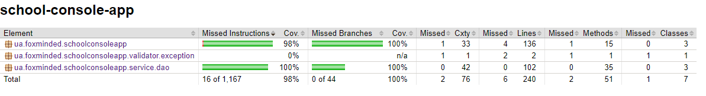

# task2.3

The 'school-console-app' is a Spring Boot application optimized for managing school data. It
employs a service layer for streamlined interactions between DAOs and business logic. The
application harnesses Spring JDBC API with PostgreSQL, and integrates Spring Data JPA for efficient
data handling. Notably, Spring Data JPA leverages Hibernate as its implementation framework,
enhancing ORM capabilities and further simplifying data access in the application.

